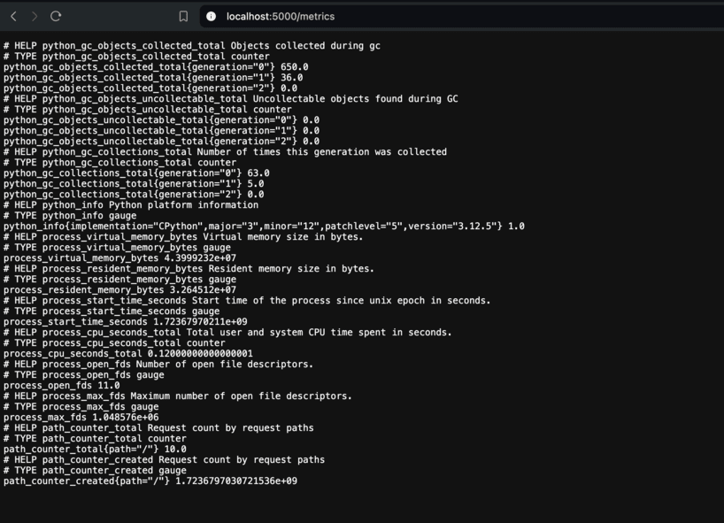
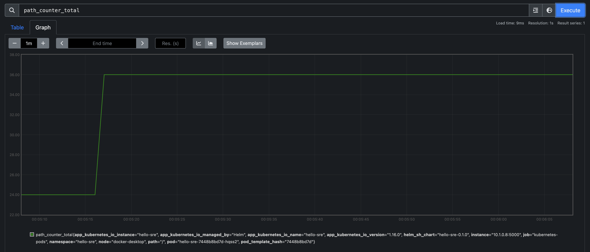

# Hello SRE

Hello SRE is a simple Python web application, utilizing Flask and Gunicorn, which delivers a message as defined by an environment variable

## Prerequisites

* Docker (or any tool to build OCI container images)
* Kubernetes Cluster
* Helm
* Terraform

## Quickstart 

build the container image:

```
docker build . -t hello-sre:<TAG>
```

Run the container

```
docker run -p 5000:5000 --name hello-sre -t hello-sre:<TAG>
```

*check your browser at `http://localhost:5000`*

---
*NOTE*: you can override the message by passing `MESSAGE` environment variable as below:

```
docker run -p 5000:5000 -e MESSAGE="Hello, World" --name hello-sre -t hello-sre:<TAG>
```

## Kubernetes

>Use any cloud provider or [minikube](https://minikube.sigs.k8s.io/) to complete this guide.

### Install
We gonna use [helm](https://helm.sh/) to deploy `./hello-sre` chart in a k8s cluster, run the below command:

```
helm install <RELEASE_NAME> hello-sre/. -n <NAMESPACE>
```

### Upgrade

refer to `./hello-sre/values.yaml` for any custom configuration, and use the below command to upgrade your chart:

```
helm upgrade <RELEASE_NAME> hello-sre/. -n <NAMESPACE>
```
---
*NOTE*: you can override the message returned by the web server by passing `MESSAGE` environment variable as following:

```
envVars:
  - name: MESSAGE
    value: "some different message"
```

### Ingress
You can apply the following confiuration under the `values.yaml` to expose the app publicy through an ingress

```
ingress:
  enabled: true
  className: "myIngressClass"
  hosts:
    - host: hello-sre.local
      paths:
        - path: /
          pathType: ImplementationSpecific
```

>*NOTE*: a prerequisit for is to have an ingress controller running, and specify the `IngressClass` name in `className` under the `values.yaml`, otherwise it will pick up the default `ingressClass` if it's defined 


## Metrics

The web server is exposing some useful Prometheus metrics under `/metrics` path



### Prometheus installtion 

Get Repository
 
```
helm repo add prometheus-community https://prometheus-community.github.io/helm-charts
helm repo update
```

Install chart
```
helm install prometheus prometheus-community/prometheus -f prometheus.yaml -n <NAMESPACE>
```

### Usage 

To let the prometheus scrape your app metrics, add the below annotation to the `values.yaml` as following:
```
podAnnotations:
  prometheus.io/scrape: "true"
  prometheus.io/path: /metrics
  prometheus.io/port: "5000"
```


### Custome configuation

you can enable extra/default metrics using `ENABLE_DEFAULT_METRICS` environment variable, use the below config in `values.yaml` as following:

```
envVars:
  - name: ENABLE_DEFAULT_METRICS
    value: True

```

### Prometheus Portal

To access the Prometheus portal and view the scraped metrics, use the following command to expose and view the portal locally 

```
kubectl port-forward -n <NAMESPACE> svc/prometheus-server 8080:80
```

This will expose the Prometheus portal under `http://localhost:8080`



## Logs
To check the web server logs, run the following command:

```kubectl logs -n <NAMESPACE> <POD_NAME>```

Sample of the access logs:
```
[2024-08-15 00:02:38 +0000] [1] [INFO] Starting gunicorn 23.0.0
[2024-08-15 00:02:38 +0000] [1] [INFO] Listening at: http://0.0.0.0:5000 (1)
[2024-08-15 00:02:38 +0000] [1] [INFO] Using worker: sync
[2024-08-15 00:02:38 +0000] [7] [INFO] Booting worker with pid: 7
{"remote_ip":"10.1.0.1","response_code":"200","request_method":"GET","request_path":"/","duration":"9","response_length":"11"}
{"remote_ip":"10.1.0.1","response_code":"200","request_method":"GET","request_path":"/","duration":"0","response_length":"11"}
{"remote_ip":"10.1.0.7","response_code":"200","request_method":"GET","request_path":"/metrics","duration":"1","response_length":"2030"}
```

## Terraform

simple terraform to extract k8s object information and save into file as json

### Init

 initialize the terraform using the following command

 ```
 cd terraform

 terraform init
 ```

 ### Usage

 Run plan/apply under the `./terraform/` directory

 ```
 terraform plan
 ```
 ```
 terraform apply
 ```

a file called `info.json` will be created with the below info:

```
{
  "cluster_ip": "10.x.x.x",
  "name": "hello-sre",
  "namespace": "hello-sre",
  "port": 5000
}
```

## TODO

### Helm

* Support the chart with `HorizontalPodAutoscaler` to scale our app horizontally based on defined metrics.


### Monitoring

#### Persistent
* Ensure Prometheus data persists by setting up a volume, which prevents data loss even if the container is restarted
* Another option is creating a third party tool like Thanos/Mimir for long term storage and highly availability

#### Operator
Use the `prometheus-operator` chart to have more control over the scrape config.

#### Visualization
Deploy Grafana alongside Prometheus to create predefined dashboards for visualization.

### Terraform
* Use a centralized storage for storing the state file (e.g., S3)
* Use Locking state mechanism (e.g., DynamoDB)

### CI/CD

* **CI**: 
  * Use github actions to build our container image and push it to our private registery
  * Run some static code analysis, unit, or load testing.
* **CD**: 
  * Implement a GitOps tool to deploy the new version of our app (e.g., ArgoCD, FluxCD) 

>*One tool can be used for both CI and CD (e.g., Github Actions, Jenkins, Gitlab CI/CD)*